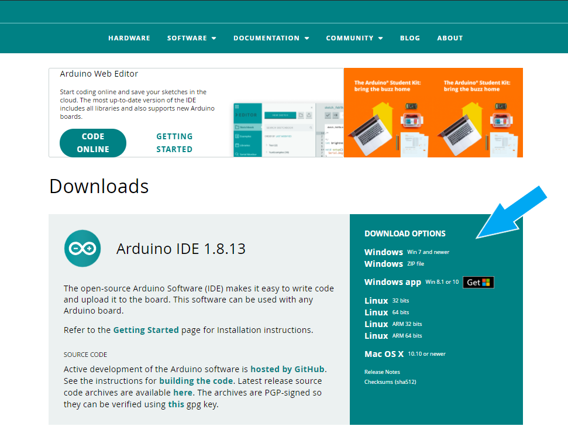

Barebones Kit Coding
====================

This is the code explanation and tutorial for the Barebones Kit. If you are using
a **BME280** sensor, then you can follow along as well.

Step 1 - Installing the ArduinoIDE:
-----------------------------------

Go over to the `arduino.cc <https://www.arduino.cc/en/software>`_ and download the latest stable release of the ArduinoIDE.

Here is an indepth tutorial on how to install the ArduinoIDE: `<https://www.arduino.cc/en/Guide>`_

Step 2 - Installing the required libraries and boards:
------------------------------------------------------

These are the list of the required libraries.

Required Libraries:

#. **ArduinoJson** By Bartoz Bielawski
#. **BME280 Sensor library** By Adafruit Industries
#. **HTTPClient** By Arduino
#. **WiFi** By Arduino

If you need help in installing the libraries, check out this link: `<https://www.arduino.cc/en/Guide/Libraries>`_

Install the ESP32 Boards from this link: `<https://randomnerdtutorials.com/installing-the-esp32-board-in-arduino-ide-windows-instructions/>`_

After Installing the boards, Select the **ESP32 Development Board** as your board.

Step 3 - Writing the Code:
--------------------------

Now that we have our dependencies in place, we can move forward to writing the actual code.

Open up a new sketch in the ArduinoIDE and follow along.

New to Arduino Sketches? Visit this: `<https://www.arduino.cc/en/Tutorial/Sketch>`_ 

Import the Libraries:
#####################

We need to import the above mentioned libraries into our sketch.

.. code-block:: C++

    #include <ArduinoJson.h> 
    #include <Adafruit_BME280.h>
    #include <HTTPClient.h> 
    #include <WiFi.h>

* **ArduinoJson** is used to create json document which we will sent to the website using an API.
* **Adafruit_BME280** is a library contributed by the Adafruit Industries which helps us interface with the BME280 sensor
* **HTTPClient** is used to make HTTP Requests such as POST.
* **WiFi** is used to connect the ESP32 to your WiFi Network.

Define your variables:
######################

.. code-block:: C++

    HTTPClient http;

    Adafruit_BME280 bme;

    float temperature;
    float humidity;
    float pressure;

    long timerDelay = ;

Enter a suitable interval at which your device will send data to our server.

**Caution: The time should be set in milliSeconds, eg: 5 seconds = 5000**

setup() :
#########

.. code-block:: C++

    void setup() {
        Serial.begin(115200);
        WiFi.begin("*your_wifi_name*", "*your_pass*");
        Serial.println();
        Serial.print("Connecting...");

        while (WiFi.status() != WL_CONNECTED) {
            delay(500);
            Serial.print(".");
        }

        if (WiFi.status() == WL_CONNECTED){
            Serial.println();
            Serial.println("Connected to :");
            Serial.println(WiFi.SSID());
            Serial.println("IP address: ");
            Serial.println(WiFi.localIP());
        }
        
        if (!bme.begin(0x76)) {
            Serial.println(F("Could not find a valid BME280 sensor, check wiring!"));
            while (1) delay(10);
        }
        
        }

In the 3rd line, replace *your_wifi_name* and *your_pass* with your credentials. 
This enables the ESP32 to connect to your **Home / Office WiFi Network**.

.. code-block:: C++

    if (!bme.begin(0x76)) {
            Serial.println(F("Could not find a valid BME280 sensor, check wiring!"));
            while (1) delay(10);
        }

This Code snippet is used to ensure the BME280 is connected correctly to the ESP32.

loop ():
########

.. code-block:: C++

    void loop(){

        if (WiFi.status() != WL_CONNECTED){
            ESP.restart();
        }

        temperature = bme.readTemperature(); //Retrieves the Temperature Data from the BME280.
        pressure = bme.readPressure() / 100; //Retrieves the Pressure Data from the BME280.
        humidity = bme.readHumidity(); //Retrieves the Humidity Data from the BME280.

        Serial.println("Temp: ");
        Serial.print(temperature);
        Serial.println("Humi: ");
        Serial.println(humidity);
        Serial.println("Press: ");
        Serial.println(pressure);

        String str_temperature = String(temperature); //Making a String Variable hold the Temperature data for further use.
        String str_pressure = String(pressure); //Making a String Variable hold the Pressure data for further use.
        String str_humidity = String(humidity); //Making a String Variable hold the Humidity data for further use.

        Serial.print("[HTTPS] begin...\n");
        if (http.begin("https://beta.api.weatherstationproject.com/data/update")) {  // HTTPS connection between the ESP32 and the Website is established.
        
        http.addHeader("Content-Type", "application/json"); //A Header is added to the Connection
        }

        StaticJsonDocument<200> json_data; //The JSON Document which will be used to send the data to the website is created
        // Add values in the document
        //
        json_data["token"] = "*your_token*"; //Paste your board's token here form your account page on our Website. 5f1879770056d
        json_data["rainfall"] = "-255";            //These are the parameters supported by our API. As the Barebones Kit Only comes with
        json_data["wind_speed"] = "-255";          //Temperature, Pressure, and Humidity, we are using the value "-255" to indicate that 
        json_data["wind_direction"] = "-255";      //the respective sensors are not connected / used.
        json_data["soil_moisture"] = "-255";
        json_data["lux"] = "-255";
        json_data["uv_index"] = "-255";               
        json_data["temperature"] = str_temperature; //We are using the String variable created earlier here to add it to the JSON document
        json_data["pressure"] = str_pressure;
        json_data["humidity"] = str_humidity;

        String requestBody;
        serializeJson(json_data, requestBody); //Finalizes the JSON document and makes it ready for transfer.

        int httpResponseCode = http.POST(requestBody); //Handles the POST Request to the API
        Serial.println(httpResponseCode); // Prints out the Response Code of the API. Useful to determine if the code is working correctly.
        String payload = http.getString(); 
        Serial.println(payload); // Prints out the Response paylode of the API. Gives a more human readable version of the Response Code.

        http.end(); //Ends the HTTP Connection to the website as the work is done.
        
        delay(timerDelay); //Starts the delay which was initialized in the start of the code. After the set time, the board sends data to the website again.

        }

This is a big section, so lets break it down.

.. code-block:: C++

    temperature = bme.readTemperature();
    pressure = bme.readPressure() / 100; 
    humidity = bme.readHumidity();

Retrieves **Humidity, Temperature, and Pressure** data from the BME280 Sensor. It is converted into ``String`` data type in the next few lines.

.. code-block:: C++

    http.begin("https://beta.api.weatherstationproject.com/data/update")

Establishes a connection between the **ESP32** and our Servers *via* the Internet.

.. code-block:: C++

    http.addHeader("Content-Type", "application/json");

    StaticJsonDocument<200> json_data;

Adds a **Header** to the connection and creates a **JSON Document** to transport the *payload* (data).

.. code-block:: C++

    json_data["token"] = "*your_token*"; 
    json_data["rainfall"] = "-255";      
    json_data["wind_speed"] = "-255";    
    json_data["wind_direction"] = "-255";
    json_data["soil_moisture"] = "-255";
    json_data["lux"] = "-255";
    json_data["uv_index"] = "-255";
    json_data["temperature"] = str_temperature; 
    json_data["pressure"] = str_pressure;
    json_data["humidity"] = str_humidity;

    String requestBody;
    serializeJson(json_data, requestBody);

**Fields** are created and data is added to them. The JSON document is **Serialized** and prepared for transfer.

-------------------------------------------------------------------------------------------------

:Caution: The Value "**-255**" is entered in some fields to signify that we dont have data for those.

-------------------------------------------------------------------------------------------------

.. code-block:: C++

    int httpResponseCode = http.POST(requestBody); 
    Serial.println(httpResponseCode); 
    String payload = http.getString();
    Serial.println(payload); 

    http.end(); 

    delay(timerDelay);

* Handles the **POST Request** to the API.
* Prints out the **Response Code** (Useful to determine if the code is working correctly).
* Prints out the **Response paylode** (gives a more human readable version of the Response Code).
* **Ends the HTTP Connection** to the server.

Compile and Upload:
###################

Connect your ESP32 to your PC and follow the steps in setting it up.

After successful configuration, compile your code and check for errors and upload!

Open your Serial Monitor to view the prints in real time! Visit `<weatherstationproject.com>`_ and login. Go to boards and check the status of your board.

You are done!

What next?
##########

Try to display your data elsewhere using our APIs. Visit `<Weather Station Project API>`_ for more details.